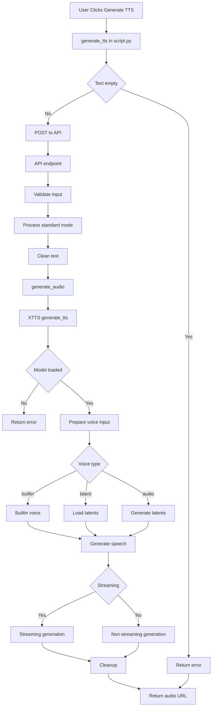
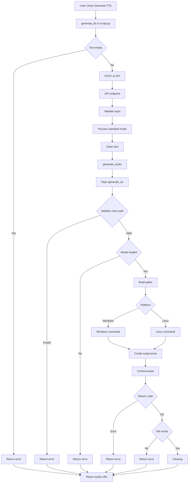

# TTS Generation Flowcharts - XTTS and Piper Engines

This document contains detailed Mermaid flowcharts showing the complete TTS generation flow from UI button click to audio playback for both XTTS and Piper engines in standard mode.

## Legend

- **Rectangles:** Function calls
- **Diamonds:** Decision points
- **Rounded Rectangles:** Start/End points
- **Red Edges:** Error handling paths
- **Subgraphs:** Group related functions by layer (UI, API, Engine)

---

## XTTS Engine Flowchart

---

## Piper Engine Flowchart

---

## Function Reference Table

### Common Functions (Both Engines)

| Function | File | Line | Description |
|----------|------|------|-------------|
| generate_tts | script.py | 2803 | UI function that sends TTS request to API |
| apifunction_generate_tts_standard | tts_server.py | 2472 | API endpoint for standard TTS generation |
| tts_validate_and_prepare_input | tts_server.py | 2056 | Validates and prepares TTS input parameters |
| tts_process_standard_mode | tts_server.py | 2330 | Processes text in standard mode |
| tts_handle_output_paths | tts_server.py | 2118 | Generates output paths and URLs |
| tts_clean_text | tts_server.py | 2146 | Cleans and filters input text |
| generate_audio | tts_server.py | 1042 | Central audio generation function |

### XTTS-Specific Functions

| Function | File | Line | Description |
|----------|------|------|-------------|
| generate_tts | xtts/model_engine.py | 1423 | Main XTTS generation function |
| _validate_generation_inputs | xtts/model_engine.py | 1365 | Validates model is loaded |
| _prepare_voice_input | xtts/model_engine.py | ~1200 | Processes different voice types |
| _load_latents | xtts/model_engine.py | 1549 | Loads speaker latents from JSON |
| _generate_conditioning_latents | xtts/model_engine.py | 1538 | Generates conditioning latents from audio |
| _generate_streaming | xtts/model_engine.py | ~1250 | Generates streaming audio |
| _generate_non_streaming | xtts/model_engine.py | 1325 | Generates non-streaming audio |
| _generate_api_tts | xtts/model_engine.py | 1376 | Generates audio using API-TTS method |
| _cleanup_after_generation | xtts/model_engine.py | 1340 | Cleanup after generation |

### Piper-Specific Functions

| Function | File | Line | Description |
|----------|------|------|-------------|
| generate_tts | piper/model_engine.py | 508 | Main Piper generation function |
| _validate_file_exists | piper/model_engine.py | 502 | Validates file exists |

### Error Handling

| Error Type | Location | HTTP Status |
|------------|----------|------------|
| Empty text | script.py:2850 | N/A (UI message) |
| Null API URL | script.py:2831 | N/A (UI message) |
| No model loaded | xtts/model_engine.py:1372 | 400 |
| Invalid voice path | piper/model_engine.py:518 | 400 |
| No voices found | piper/model_engine.py:526 | 400 |
| Subprocess failed | piper/model_engine.py:600 | 500 |
| File not found | tts_server.py:2602 | 404 |
| Permission denied | tts_server.py:2605 | 403 |
| Validation error | tts_server.py:2599 | 400 |
| Out of memory | tts_server.py:2614 | 507 |
