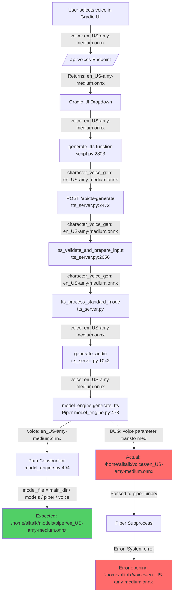

# Voice Path Flow Diagram

This document shows the step-by-step flow of the voice parameter through the AllTalk TTS system, highlighting where the path transformation bug occurs.

## Mermaid Flowchart

## Detailed Step-by-Step Flow

### Step 1: Voice Selection in Gradio UI
- **Location:** `script.py` line 3046
- **Input:** User selects voice from dropdown
- **Voice path:** `en_US-amy-medium.onnx` (relative path)
- **Source:** `_state["srv_current_voices"]` which is populated from `/api/voices`

### Step 2: /api/voices Endpoint
- **Location:** `tts_server.py` line 405
- **Function:** `apifunction_get_voices()`
- **Calls:** `model_engine.voices_file_list()`
- **For Piper:** Calls `piper_voices_file_list()` in `piper_settings_page.py`
- **Returns:** Relative paths like `["en_US-amy-medium.onnx", "en_US-ljspeech-high.onnx"]`
- **Voice path out:** `en_US-amy-medium.onnx` (relative path)

### Step 3: Gradio UI State Population
- **Location:** `script.py` line 1476
- **Function:** `get_alltalk_settings()`
- **Voice path in:** `en_US-amy-medium.onnx` (from API)
- **Voice path out:** `en_US-amy-medium.onnx` (stored in `_state["srv_current_voices"]`)

### Step 4: Generate TTS Function (Gradio UI)
- **Location:** `script.py` line 2803
- **Function:** `generate_tts()`
- **Voice path in:** `en_US-amy-medium.onnx` (from dropdown)
- **Voice path out:** `en_US-amy-medium.onnx` (sent as `character_voice_gen` in POST data)

### Step 5: API Endpoint /api/tts-generate
- **Location:** `tts_server.py` line 2472
- **Function:** `apifunction_generate_tts_standard()`
- **Voice path in:** `en_US-amy-medium.onnx` (from form data)
- **Voice path out:** `en_US-amy-medium.onnx` (passed to validation)

### Step 6: Validation and Preparation
- **Location:** `tts_server.py` line 2056
- **Function:** `tts_validate_and_prepare_input()`
- **Voice path in:** `en_US-amy-medium.onnx`
- **Voice path out:** `en_US-amy-medium.onnx` (no transformation)

### Step 7: Standard Mode Processing
- **Location:** `tts_server.py` (tts_process_standard_mode)
- **Voice path in:** `en_US-amy-medium.onnx`
- **Voice path out:** `en_US-amy-medium.onnx` (passed to generate_audio)

### Step 8: generate_audio Function
- **Location:** `tts_server.py` line 1042
- **Function:** `generate_audio()`
- **Voice path in:** `en_US-amy-medium.onnx`
- **Voice path out:** `en_US-amy-medium.onnx` (passed to model_engine.generate_tts)

### Step 9: Piper Engine generate_tts
- **Location:** `system/tts_engines/piper/model_engine.py` line 478
- **Function:** `generate_tts()`
- **Voice path in:** Should be `en_US-amy-medium.onnx`
- **BUG:** Voice path is actually `/home/alltalk/voices/en_US-amy-medium.onnx` (full incorrect path)

### Step 10: Path Construction in Piper
- **Location:** `system/tts_engines/piper/model_engine.py` line 494
- **Code:** `model_file = self.main_dir / "models" / "piper" / voice`
- **Expected voice path in:** `en_US-amy-medium.onnx`
- **Expected model_file:** `/home/alltalk/models/piper/en_US-amy-medium.onnx`
- **Actual voice path in:** `/home/alltalk/voices/en_US-amy-medium.onnx` (BUG)
- **Actual model_file:** Incorrect due to absolute path in voice parameter

### Step 11: Piper Subprocess Execution
- **Location:** `system/tts_engines/piper/model_engine.py` line 532
- **Command:** `piper -m <model_file> -c <config_file> -f <output_file>`
- **Error:** `Error opening '/home/alltalk/voices/en_US-amy-medium.onnx': System error`
- **Root cause:** Piper binary receives incorrect full path instead of relative filename

## Key Findings

1. **Correct behavior:** `/api/voices` returns relative paths correctly
2. **Bug location:** Voice parameter is transformed to full path `/home/alltalk/voices/en_US-amy-medium.onnx` somewhere between the API endpoint and Piper's `generate_tts` function
3. **Expected behavior:** Voice parameter should remain as relative filename `en_US-amy-medium.onnx`
4. **Impact:** Piper binary cannot find the voice file because it's looking in the wrong directory

## Investigation Points

- Check if `model_engine.def_character_voice` contains a full path
- Check if any middleware or dependency function modifies the voice parameter
- Check if the voice parameter is being read from a configuration file with incorrect paths
- Verify the actual value of the voice parameter reaching Piper's `generate_tts` function (debug logging added)
